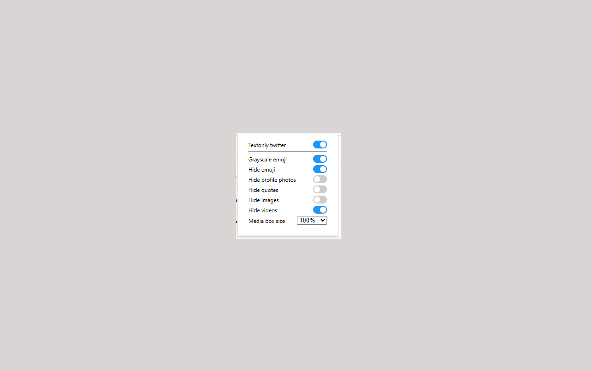

# Textonly X

This repo base on excellent work of https://github.com/ette9844 in https://github.com/ette9844/textonly-twitter 

I added features that I want but were missing

Chrome extension to hide twitter media. Make your twitter simpler.. Download it from [Chrome Webstore](https://chrome.google.com/webstore/detail/textonly-twitter/dbonhfkddcpbknmccjclfigmfkpimfkf).

# Screenshots

# Features:

Current options in the popup:
- Text-only mode
- Grayscale emoji
- Hide emoji
- Hide profile photos
- Hide quotes
- Hide images
- Hide videos
- Media box size

Behavior notes:
- Profile photos are visible by default
- Images are visible by default
- Videos are hidden by default
- Quotes can be hidden independently from images and videos
- When Hide quotes is enabled, quote cards collapse to a "+ Show quote" placeholder and expand on hover
- When Hide images is enabled, image posts collapse to a "+ Show image" placeholder and expand on hover
- When Hide videos is enabled, video posts collapse to a "+ Show video" placeholder and expand on hover

# Change Log

## 1.1 (2022-06-22)

- add setting popup
- store setting in local storage

## 1.11 (2022-06-22)

- resolve setting saving error

## 1.12 (2022-10-01)

- side menu to top menu
- add top menu setting
- add hide emoji setting

## 1.13 (2023-06-13)

- available on dark mode
- available on all font size

## 1.14 (2024-07-08)

- modify css to match latest x version
- add x domain in manifest

## 1.15 (2024-07-09)

- change menu selector in detail

## 1.16 (2026-04-01)

- add a setting to control whether tweet profile photos are hidden
- default to showing profile photos so text-only mode is less aggressive

## 1.17 (2026-04-01)

- add a setting to control whether quoted posts are hidden
- hide quotes independently from media hiding
- show a "+ Show quote" placeholder and reveal the quote on hover
- narrow media selectors so quote handling does not interfere with image hiding

## 1.18 (2026-04-01)

- split media controls into separate image and video settings
- add Hide images, disabled by default
- add Hide videos, enabled by default
- change the video placeholder from "+ Show media" to "+ Show video"
- add a "+ Show image" placeholder for hidden images

## 1.19 (2026-04-01)

- hide "+ Show image" and "+ Show video" placeholders on hover
